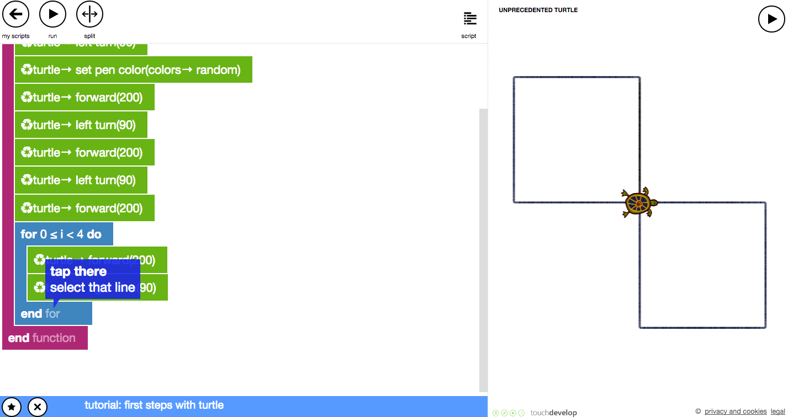
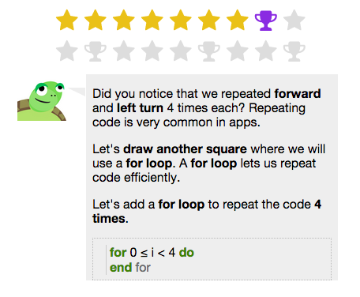

# touchdevelop-turtlegame
The turtle game on Touch Develop gives students a fun, interactive introduction to programming.

## Prerequisites

* Students only need to access [touchdevelop.com](https://touchdevelop.com) and sign in, preferably with Google, in order to save their progress. Signing in is ideal but not required in order to run through the tutorial.

## Concepts

* For loops
* Variables

## What is Touch Develop?

TouchDevelop is an interactive development environment and a visual programming language being developed at Microsoft Research.
TouchDevelop is used to develop application programs for mobile devices, including smartphones and tablet computers. It can also be used on any computer which has a suitable web browser. In addition to its use as a tool for creating application programs, TouchDevelop has been used to teach programming and mobile device technology at schools, colleges and universities.

Touch Develop is primarily meant to be used on touch-enabled devices so it says tap as opposed to click but all the tasks can be performed with ease on a laptop. 

## Pointers

* [Here's a breakdown](https://www.touchdevelop.com/docs/firststepswithturtle) of each step that you can reference.

* It's important to tell students to read instructions at the beginning of each step so they understand the concepts and aren't just rapidly clicking through the tutorial. Touch Develop will attempt to explain concepts to students and you should help them understand those concepts. In the case of this tutorial students are learning `for` loops but they could run through everything and not understand them all that well.

* You can run through the tutorial exclusively by clicking the proper commands. Encourage students to type them out as a challenge. 

* If students finish ahead of time, tell them to go back and further edit the code by changing the speed, colors, and angles.
